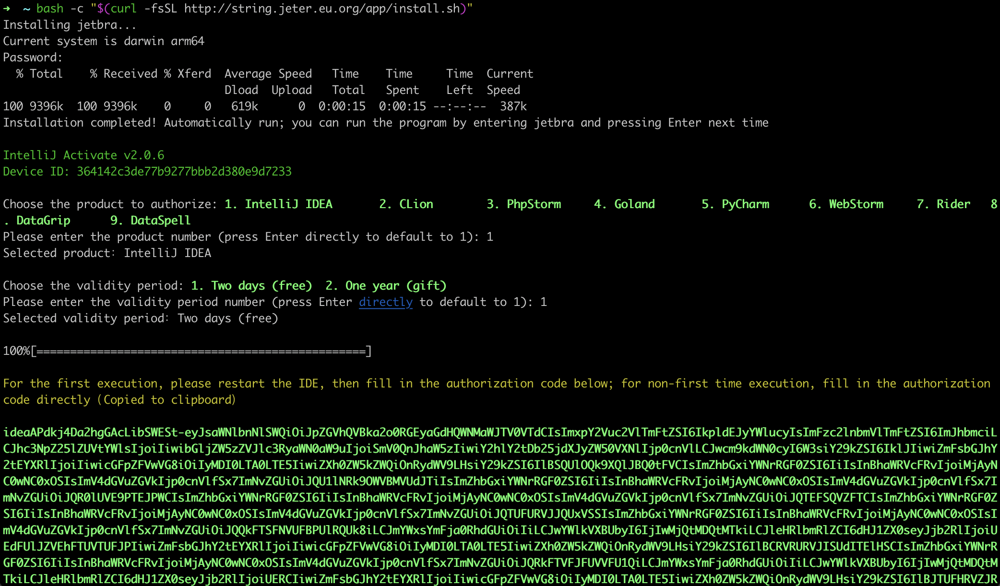

## Jetbra Activate

[中文](./README_CN.md)

Jetbra Active is a JetBrains IDE activation tool that helps you quickly activate JetBrains IDE.
---
### Usage

Open the terminal on MacOS/Linux; Open Git Bash on Windows. Then execute the following command to install:
>some computers may report false positives, need to close the antivirus software/computer housekeeper/security protection and then proceed

*  Method 1:Install via GitHub script
```shell
bash <(curl -Lk https://github.com/kingparks/jetbra-activate/releases/download/latest/i.sh) githubReadme
```
*  Method 2:Install via ghp.ci proxy script
```shell
bash <(curl -Lk https://ghp.ci/https://github.com/kingparks/jetbra-activate/releases/download/latest/install.sh) githubReadme
```
* Method 3: Manually download the binary file
> Download the binary file for the corresponding operating system from the [release](https://github.com/kingparks/jetbra-activate/releases) page
 ```shell
# MaxOS/Linux
sudo mv jetbra_xx_xxx /usr/local/bin/jetbra;
chmod +x /usr/local/bin/jetbra;
jetbra githubReadme;
# Windows 
# 双击 jetbra_xx_xxx.exe
```
* Method 4:Install via go install 
```shell
go run github.com/kingparks/jetbra-activate@latest githubGoReadme;
```

---
### Features

> This activation method is compatible with all JetBrains software, such as IntelliJ IDEA, AppCode, CLion, DataGrip, GoLand, PhpStorm, PyCharm, Rider, RubyMine, and WebStorm. It also supports Windows, Mac, and Linux platforms. This activation method supports account login, online updates, cross-platform functionality, and the latest version (genuine activation)




### Star History
