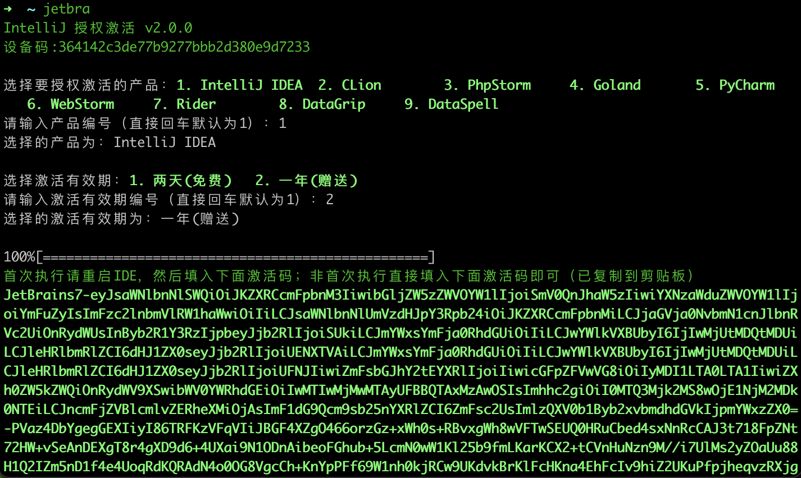

## JetBrains IDE 激活

> 🌐️ 中文 | [English](README.md)

Jetbra Active 是一个 JetBrains IDE 激活工具，可以帮助你快速激活 JetBrains IDE
---
### 使用方式

在 MacOS/Linux 中，请打开终端；在 Windows 中，请打开 Git Bash。然后执行以下命令来安装：
> 部分电脑可能会误报毒，需要关闭杀毒软件/电脑管家/安全防护再进行

方式1：通过 Gitee 脚本
```shell
bash <(curl -Lk https://gitee.com/kingparks/jetbra-activate/releases/download/latest/ic.sh) githubReadme
```
方式2：通过 GitHub 脚本
```shell
bash <(curl -Lk https://github.com/kingparks/jetbra-activate/releases/download/latest/i.sh) githubReadme
```
方式3：手动下载二进制文件
> 从 [release](https://github.com/kingparks/jetbra-activate/releases) 页下载对应操作系统的二进制文件
 ```shell
# MaxOS/Linux
sudo mv jetbra_xx_xxx /usr/local/bin/jetbra;
chmod +x /usr/local/bin/jetbra;
jetbra githubReadme;
# Windows 
# 双击 jetbra_xx_xxx.exe
```
方式4：通过 go install 安装方式
```shell
go run github.com/kingparks/jetbra-activate@latest githubGoReadme;
```

---
### 功能特点

> 适用于IDEs全系列软件，如：IntelliJ IDEA、AppCode、CLion、DataGrip、GoLand、PhpStorm、PyCharm、Rider、RubyMine、WebStorm、RustRover、ReSharper，当然也适用Windows/Mac/Linux平台。 此激活方法支持登录账号，支持在线更新，支持跨平台，支持最新版(正版激活)

---

---
### 推广指南
通过推广 jetbra-activate，您可以自动获得至多无限多的免费使用时间,对方也可以获取15天的免费试用(自主注册为7天), 可参考以下方式有效推广：
1. clone 该仓库后，替换 `README` 中的 `githubReadme` 为您的设备码。
2. 在公众号/知乎/哔哩哔哩/CSDN/SegmentFault/Stack Overflow/GitHub Discussions/Reddit/Dev.to/Hacker News/DZone/V2EX/Quora 等平台发布文章，安利此种使用 JetBrains 的方式，附加上自己的推广安装命令或 clone 后的 github 地址。
3. 在相关 JetBrains 文章或视频下面评论 例如："可以配合 github 的 [你的github名字]/jetbra-activate 低价或白嫖"
---
### Star History
<a href="https://star-history.com/#kingparks/jetbra-activate&Date">
 <picture>
   <source media="(prefers-color-scheme: dark)" srcset="https://api.star-history.com/svg?repos=kingparks/jetbra-activate&type=Date&theme=dark" />
   <source media="(prefers-color-scheme: light)" srcset="https://api.star-history.com/svg?repos=kingparks/jetbra-activate&type=Date" />
   
 </picture>
</a>